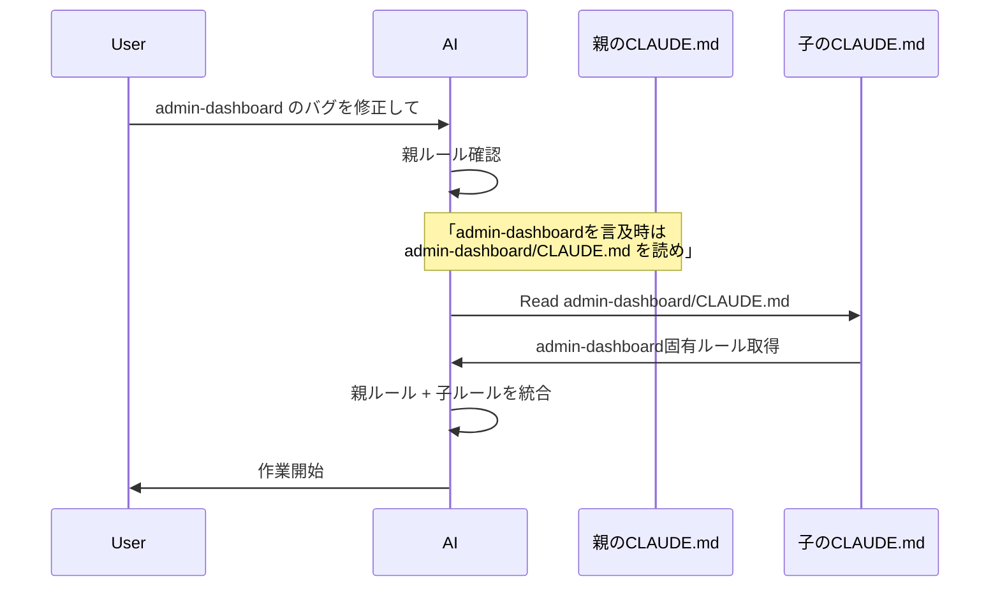

# マルチレポ対応AGENTS.md/CLAUDE.md設計パターン【3段階テンプレート】

## TL;DR（要約）

マルチレポ構成で**親ディレクトリから IDE を開くと、子サービスのルールが無視される**問題を解決するテンプレート集です。

**解決策**：

- 3層構造（global / multi_service_parent / project）で子サービスのルールを確実に適用
- AGENTS.md で Claude Code / Cursor / Windsurf / Codex を統一管理
- メンテナンス負荷に応じて3段階（フル機能版 / 統一版 / ミニマル版）から選択

**対象読者**：

- マルチレポ構成で複数サービスを横断的に開発している方
- 複数の AI コーディングツールを併用している方
- AI へのルール設定を効率的に管理したい方

---

## 📌 この記事の使い方

**すぐ使いたい方**：

- **[実装ガイド](#実装ガイド)** へジャンプ → 5分でセットアップ完了
- **[運用パターン選択](#運用パターン別の構成例)** で自分の構成を確認

**仕組みを理解したい方**：

- **[課題と本記事の位置づけ](#課題と本記事の位置づけ)** から順に読む
- **[3層構造の設計思想](#解決策3層階層構造)** を理解

**メンテナンス負荷を減らしたい方**：

- **[3つのレベル比較](#メンテナンス戦略3つのレベル)** で最適解を選択

---

## 課題と本記事の位置づけ

### 複数AIツールの保守負荷

開発環境では当初 Cursor・Windsurf を併用し、現在は Claude Code・Cursor を活用しています。さらに最近 OpenAI Codex も登場し、**各ツール用のルールファイルを個別に保守する負荷**が増大していました。

- Cursor: `.cursor/rules/*.mdc` / `.cursorrules`
- Windsurf: `.windsurfrules` / `global_rules.md`
- Claude Code: `CLAUDE.md`
- OpenAI Codex: `AGENTS.md`

それぞれ微妙に記法や配置場所が異なり、同じルールを複数ファイルで管理する必要がありました。

### マルチレポ構成での精度低下

実務では以下のようなマルチレポ構成が一般的です：

- **フロントエンド・バックエンド両方を理解して作業**する必要がある
- **DBサービスが複数サービスで共有**されている
- **公開対象が異なる**ため別リポジトリだが**相互依存**している

こうした環境では、**親ディレクトリからIDEを開きたい**のですが、既存手法では以下の問題がありました：

> **親から開くと、子サービスのルールに従ってくれない**
>
> 起動した親リポジトリのルールのみを遵守し、作業対象の子サービス固有のルール（技術スタック・コーディング規約等）が無視され、精度が著しく低下

例：

```
~/projects/ecommerce-platform/    # ← 親ディレクトリから開く
├── admin-dashboard/               # 管理者用ダッシュボード（Next.js + TypeScript）
│   ├── .git/                      # ← 独立したGitリポジトリ
│   └── CLAUDE.md                  # ← 無視される
├── customer-app/                  # 利用者用アプリ（React Native + TypeScript）
│   ├── .git/                      # ← 独立したGitリポジトリ
│   └── CLAUDE.md                  # ← 無視される
└── backend-api/                   # バックエンドAPI（Python + FastAPI）
    ├── .git/                      # ← 独立したGitリポジトリ
    └── CLAUDE.md                  # ← 無視される
```

### 先人の知見を活かしつつ、マルチレポに対応

この課題を解決するため、以下の方々の公開知見を参考にさせていただきました：

- [kinopeee](https://github.com/kinopeee) さん - [cursorrules](https://github.com/kinopeee/cursorrules)
- [sazan_dev](https://x.com/sazan_dev) さん - [X投稿](https://x.com/sazan_dev/status/1968222841981002203)
- [sesere](https://zenn.dev/sesere) さん - [Zenn記事](https://zenn.dev/sesere/articles/0420ecec9526dc)

先人の方々の知見を活かしつつ、**マルチレポ構成特有の課題**に対応するための拡張パターンを提案します。これらのアイデアを実務で活用する中で見つかった課題（マルチレポ・親子ディレクトリでの精度低下）を解決するために、3層構造に発展させました。

オープンソースコミュニティの知見共有に感謝いたします。

### 公式の階層読み込みの仕様と実装の乖離

Claude Code の CLAUDE.md や AGENTS.md 標準（[公式サイト](https://agents.md/)）では、階層的な読み込みがサポートされています：

- **起動ディレクトリから親へ遡る**: 自動読み込み ✅
- **子ディレクトリ**: ファイルアクセス時に遅延読み込み（[参考](https://stevekinney.com/courses/ai-development/claude-dot-md)）

### マルチレポでの課題

**親ディレクトリから IDE を開いた場合**、以下の問題があります：

**CLAUDE.md の場合**：

- 仕様上、子の CLAUDE.md は**ファイルアクセス時に読み込み**
- 実装には**バグ報告多数**（Reddit / GitHub で「nesting is incredibly unreliable」との報告）
- 結果：**子のルールが読まれない、または不確実**

**AGENTS.md の場合**：

- 仕様上、「編集ファイルから最も近いファイル」を読み込み（Nearest File Wins）
- 筆者の実験では、親から開くと**親の AGENTS.md のみ読み込まれ、子は無視された**

**共通の問題**：

- ユーザーが「admin-dashboard を修正して」と指示
- AI は親のルールしか知らない状態で作業開始
- サービス固有のルール（技術スタック・コーディング規約）が無視される

**本記事の手法は、この課題を確実に解決します。** 将来的に公式実装が改善される可能性はありますが、現時点（2025年10月）では確実な動作のために本手法を推奨します。

---

## 解決策：3層階層構造

### なぜ3層なのか？

以下のユースケースに対応する必要がありました：

**マルチレポでの2つのアクセスパターン**：

1. **親ディレクトリから複数リポジトリを開く** - 複数サービスを横断的に作業
2. **特定サービスのみをIDEで開く** - 単一サービスに集中

この2つを同時に満たすために、以下の3層構造を設計しました：

```
global/              # 全プロジェクト共通（~/.claude/CLAUDE.md 相当）
multi_service_parent/  # マルチサービス親ディレクトリ
project/             # 各サービス固有
```

### 各層の役割

| 層                       | 配置場所                   | 読み込み条件         | 主な内容                       |
| ------------------------ | -------------------------- | -------------------- | ------------------------------ |
| **global**               | `~/.claude/` 等            | 常に読み込み         | AI運用原則、技術文書作成ルール |
| **multi_service_parent** | プロジェクト親ディレクトリ | 親から開いた場合のみ | サービス横断ルール、即座参照   |
| **project**              | 各サービスディレクトリ     | 該当サービス作業時   | 技術スタック、個別制約         |

### 実際の使用例：admin-dashboard サービス作業時

ユーザーが「admin-dashboard のバグを修正して」と指示した場合：



**multi_service_parent/CLAUDE.md の仕組み**：

```markdown
## サービス名言及時の即座解決:

- ユーザーが `admin-dashboard`, `customer-app`, `backend-api` 等を単独で言及した場合
- 即座に `{サービス名}/CLAUDE.md` を Read（Glob・find による探索は禁止）
```

この仕組みにより、**親から開いても子サービスのルールが確実に適用**されます。

---

## クロスプラットフォーム対応：CLAUDE.md vs AGENTS.md

### 2つのファイル形式を用意した理由

各AIツールの対応状況：

| AIツール     | CLAUDE.md | AGENTS.md | 備考                          |
| ------------ | --------- | --------- | ----------------------------- |
| Claude Code  | ✅        | △         | CLAUDE.md推奨（固有機能あり） |
| Cursor       | ❌        | ✅        | AGENTS.md対応                 |
| Windsurf     | ❌        | ✅        | AGENTS.md対応（実験確認）     |
| OpenAI Codex | ❌        | ✅        | AGENTS.md対応                 |

### CLAUDE.md の固有機能（Claude Code専用）

```markdown
<every_chat>

## AI運用6原則

**第1原則**: AIはファイルやシステムに副作用を伴う操作に限り、
実行前に必ず自身の作業計画を報告し、y/nでユーザー確認を取る。

<!-- 中略 -->

**第6原則**: AIは**あなたの毎回の応答の先頭**に、
必ずこの`<every_chat>`ブロック内の内容を**逐語的にコピー&ペースト出力**する。

</every_chat>
```

このような **XML風のブロック構文**や**特殊な制御命令**は Claude Code で有効ですが、他のツールでは無視されます。

### AGENTS.md の汎用性（複数ツール共通）

```markdown
# プロジェクト固有ガイドライン

## 0. 前提

- @README.md

### 技術スタック

- @technologystack.md

## 1. 基本動作原則

- **指示理解**: ユーザー指示を精読し、範囲・制約・依存関係を確認する。
```

標準的な Markdown のみで記述し、すべてのツールで読み込めるようにしています。

:::message
テンプレートには `[プロジェクト固有の情報を追記してください]` といったプレースホルダーが含まれています。プロジェクト実態に合わせた調整方法は「[カスタマイズ方法](#カスタマイズ方法)」で解説しています。
:::

---

## 発見：Windsurf は AGENTS.md を自動認識する（非公式）

### 実験結果

Windsurf 公式ドキュメントでは `.windsurfrules` と `global_rules.md` が推奨されていますが、実験の結果：

> **AGENTS.md が存在すれば、.windsurfrules の有無に関わらず Windsurf はそれを優先的に読み込む**

### 検証方法と結果

3パターンの実験を実施：

| 実験  | 配置ファイル          | 結果                                        |
| ----- | --------------------- | ------------------------------------------- |
| 実験1 | `.windsurfrules` のみ | `.windsurfrules` が読み込まれる             |
| 実験2 | 両方（内容が異なる）  | `AGENTS.md` が適用、`.windsurfrules` は無視 |
| 実験3 | `AGENTS.md` のみ      | `AGENTS.md` が正常に読み込まれる            |

**重要な発見**：Windsurf AI に「どのルールに従っているか」と質問したところ、「AGENTS.md に従っています」と明言しました。

### 実用上の意味

**結論**：`.windsurfrules` に `@AGENTS.md に従う` と書く必要すらなく、**AGENTS.md を配置するだけで Windsurf は自動認識**します。

ただし、公式に AGENTS.md 対応が明記されていないため、**念のため .windsurfrules も配置している**のが現在の運用です（実質的には不要の可能性が高い）。

### 実用上のメリット

- **Cursor・Codex と設定を完全共有**できる
- **.windsurfrules のメンテナンスが実質不要**
- **1つのファイルで複数ツール対応**が可能

:::message alert
この挙動は公式ドキュメントに記載されていないため、将来のバージョンで変更される可能性があります。2025年10月時点での検証結果です。
:::

---

## メンテナンス戦略：3つのレベル

プロジェクト規模やメンテナンス体制に応じて、3段階から選択できます。

### レベル1：フル機能版（大規模・長期プロジェクト向け）

```
ecommerce-platform/              # プロジェクトルート
├── AGENTS.md                    # 共通ルール
├── CLAUDE.md                    # Claude Code 専用
├── .windsurfrules               # Windsurf 用（念のため配置）
├── directorystructure.md
├── technologystack.md
└── admin-dashboard/
    ├── AGENTS.md
    ├── CLAUDE.md
    ├── .windsurfrules           # Windsurf 用（念のため配置）
    ├── directorystructure.md
    └── technologystack.md
```

**メンテナンス対象**：

- AGENTS.md × N（サービス数）
- CLAUDE.md × N
- directorystructure.md × N
- technologystack.md × N
- .windsurfrules × N（念のため配置。実験では AGENTS.md のみで動作）

**メリット**：最高精度、Claude Code の全機能を活用
**デメリット**：メンテナンス負荷が高い

**補足**：`.windsurfrules` は実験では不要でしたが、公式推奨のため念のため配置しています。内容は `@AGENTS.md に従う` の1行のみで十分です。

**適している状況**：

- 複数チームで開発
- 長期運用予定
- Claude Code の `<every_chat>` 等の高度な機能を活用したい

---

### レベル2：AGENTS.md統一版

```
ecommerce-platform/              # プロジェクトルート
├── AGENTS.md                    # 共通ルール
├── CLAUDE.md                    # ← 中身：- @AGENTS.md に従う（1行）
├── directorystructure.md
├── technologystack.md
└── admin-dashboard/
    ├── AGENTS.md
    ├── CLAUDE.md                # ← 中身：- @AGENTS.md に従う（1行）
    ├── directorystructure.md
    └── technologystack.md
```

**変更内容**：

1. `.windsurfrules` 削除（Windsurf は AGENTS.md を自動認識）
2. 各 `CLAUDE.md` を1行に簡略化：

```markdown
- @AGENTS.md に従う
```

**メンテナンス対象**：

- AGENTS.md × N（サービス数）
- directorystructure.md × N
- technologystack.md × N

**削減効果**：

- ✅ `.windsurfrules` メンテナンス不要
- ✅ `CLAUDE.md` の実質的なメンテナンス不要（1行のみ）

**メリット**：精度はほぼ変わらず、メンテナンス30%削減

**デメリット**：

- `<every_chat>` による毎回の原則想起ができない
- セッション長時の精度低下リスクがある（体感 25〜30% 効率低下）

**適している状況**：

- 一般的な規模のプロジェクト
- 複数のAIツールを併用
- メンテナンス負荷を抑えたい

---

### レベル3：ミニマル版（小規模・個人プロジェクト向け）

```
ecommerce-platform/              # プロジェクトルート
├── AGENTS.md                    # 共通ルール
├── CLAUDE.md                    # ← 中身：- @AGENTS.md に従う（1行）
├── README.md                    # ← 技術スタック・構成をここに統合
└── admin-dashboard/
    ├── AGENTS.md
    ├── CLAUDE.md                # ← 中身：- @AGENTS.md に従う（1行）
    └── README.md
```

**変更内容**：

1. `.windsurfrules` 削除
2. 各 `CLAUDE.md` を1行に簡略化
3. `directorystructure.md` 削除
4. `technologystack.md` 削除
5. `AGENTS.md` から `@directorystructure.md` / `@technologystack.md` 参照を削除
6. 技術情報は `README.md` に統合

**メンテナンス対象**：

- AGENTS.md × N（サービス数）
- README.md × N

**削減効果**：

- ✅ メンテナンス対象ファイル60%削減
- ✅ ファイル総数最小化

**メリット**：最小メンテナンス負荷
**デメリット**：

- 技術スタック・ディレクトリ構造の明示がないため推測ミスが増える
- @参照による明示的誘導ができない
- レベル2からさらに 5% 程度効率が低下

**適している状況**：

- 個人開発
- 小規模チーム
- メンテナンス負荷を最小化したい（精度低下を許容できる場合）

---

### 比較表

| 項目                     | レベル1（フル機能）      | レベル2（AGENTS.md統一） | レベル3（ミニマル）      |
| ------------------------ | ------------------------ | ------------------------ | ------------------------ |
| **Claude Code 作業効率** | 100%                     | 70〜75%                  | 65〜70%                  |
| **メンテナンス負荷**     | 高                       | 中                       | 低                       |
| **ファイル数**           | 5N + 1                   | 3N + 1                   | 2N + 1                   |
| **`<every_chat>` 対応**  | ✅ 使用可                | ❌ 不可                  | ❌ 不可                  |
| **Windsurf対応**         | ✅（.windsurfrules経由） | ✅（AGENTS.md直接）      | ✅（AGENTS.md直接）      |
| **初期セットアップ**     | 30分                     | 15分                     | 10分                     |
| **適している状況**       | Claude Code メイン       | 複数ツール併用           | 小規模・個人プロジェクト |

（N = サービス数 + 親ディレクトリ1つ）

---

## 実装ガイド

### テンプレートの入手

GitHubリポジトリで公開しています：

https://github.com/taka-123/ai-knowledge-rulebook

### クイックスタート

#### ステップ1：グローバル設定（個人環境）

各AIツールのグローバル設定ファイルに、テンプレートをコピーします。

**各ツールのグローバル設定パス**：

| AIツール     | グローバル設定パス（macOS）                     | 備考                         |
| ------------ | ----------------------------------------------- | ---------------------------- |
| OpenAI Codex | `~/.codex/AGENTS.md`                            |                              |
| Claude Code  | `~/.claude/CLAUDE.md`                           |                              |
| Cursor       | Settings > Rules & Memories > User Rules（GUI） | ファイルパスなし             |
| Windsurf     | `~/.codeium/windsurf/memories/global_rules.md`  | AGENTS.md でも可（実験済み） |

**Windowsの場合**：`~` を `%USERPROFILE%` に置き換えてください。

```bash
# 例：Claude Code のグローバル設定
cp ai/claude_code/global/CLAUDE.md ~/.claude/CLAUDE.md

# 例：Codex のグローバル設定
cp ai/common/global/AGENTS.md ~/.codex/AGENTS.md

# 例：Windsurf のグローバル設定（AGENTS.md で統一）
cp ai/common/global/AGENTS.md \
   ~/.codeium/windsurf/memories/global_rules.md
```

#### ステップ2：プロジェクト設定（チーム共有）

プロジェクトディレクトリに、テンプレートをコピーします。

**これらはGit管理対象**とし、チーム全員で共有します。

```bash
# マルチサービス親ディレクトリ（例：~/projects/ecommerce-platform/）
cp ai/common/multi_service_parent/AGENTS.md \
   ~/projects/ecommerce-platform/AGENTS.md

# 各サービス
cp ai/common/project/AGENTS.md \
   ~/projects/ecommerce-platform/admin-dashboard/AGENTS.md
cp ai/common/project/AGENTS.md \
   ~/projects/ecommerce-platform/customer-app/AGENTS.md
cp ai/common/project/AGENTS.md \
   ~/projects/ecommerce-platform/backend-api/AGENTS.md

# Git管理（親ディレクトリ）
cd ~/projects/ecommerce-platform
git add AGENTS.md
git commit -m "Add AI agent rules for parent directory"

# Git管理（各サービスのリポジトリ）
cd admin-dashboard && git add AGENTS.md && git commit -m "Add AI agent rules"
cd ../customer-app && git add AGENTS.md && git commit -m "Add AI agent rules"
cd ../backend-api && git add AGENTS.md && git commit -m "Add AI agent rules"
```

#### ステップ3：Claude Code で AGENTS.md を活用（レベル2の場合）

Claude Code でも AGENTS.md を活用する場合：

```bash
# CLAUDE.md を簡略化（1行のみ）
echo "- @AGENTS.md に従う" > ~/projects/ecommerce-platform/CLAUDE.md
echo "- @AGENTS.md に従う" > ~/projects/ecommerce-platform/admin-dashboard/CLAUDE.md
echo "- @AGENTS.md に従う" > ~/projects/ecommerce-platform/customer-app/CLAUDE.md
echo "- @AGENTS.md に従う" > ~/projects/ecommerce-platform/backend-api/CLAUDE.md

# Git管理（親ディレクトリ）
cd ~/projects/ecommerce-platform
git add CLAUDE.md
git commit -m "Add Claude Code integration with AGENTS.md"

# Git管理（各サービスのリポジトリ）
cd admin-dashboard && git add CLAUDE.md && git commit -m "Add Claude Code integration"
cd ../customer-app && git add CLAUDE.md && git commit -m "Add Claude Code integration"
cd ../backend-api && git add CLAUDE.md && git commit -m "Add Claude Code integration"
```

### カスタマイズ方法

テンプレートには `[プロジェクト固有の情報を追記してください]` といったプレースホルダーが含まれています。

**調整ルール**を活用してカスタマイズしてください：

https://github.com/taka-123/ai-knowledge-rulebook/blob/main/snippets/editor/adjustment_rule.md

**調整の方針**：

1. プロジェクト実態を調査
2. 実ディレクトリ・設定ファイルと照合
3. 不整合を修正
4. 全体バランスを維持

---

## 運用パターン別の構成例

### パターン1：モノレポ構成

```
# ディレクトリ構成（Git管理対象）
my-monorepo/
├── AGENTS.md                    # project テンプレート使用
│                                # frontend・backend両方の設定を1つに記述
├── frontend/
│   └── src/
└── backend/
    └── src/

# 個人設定（Git管理外）
~/.codex/AGENTS.md               # global テンプレート使用
```

**動作**：

- プロジェクトルートから開く（通常の使い方） → global + ルートの AGENTS.md が適用
- `AGENTS.md` 内で frontend・backend 両方の技術スタック・ルールを記述

**なぜ `multi_service_parent` を使わないのか**：

- モノレポは**常にルートから開く**
- frontend/ や backend/ を単独で開くことは通常ない
- したがって、`project` テンプレート1つをルートに配置すれば十分
- **階層構造は2層**（global + project）で完結する

### パターン2：マルチレポ構成（親ディレクトリから開く）★

```
# ディレクトリ構成（各サービスは独立したGitHubリポジトリ）
~/projects/ecommerce-platform/
├── AGENTS.md                    # multi_service_parent テンプレート使用
├── admin-dashboard/              # 管理者用ダッシュボード（Next.js + TypeScript）
│   ├── .git/                    # ← 独立したGitリポジトリ
│   ├── AGENTS.md                # ← project テンプレート使用
│   └── src/
├── customer-app/                 # 利用者用アプリ（React Native + TypeScript）
│   ├── .git/                    # ← 独立したGitリポジトリ
│   ├── AGENTS.md                # ← project テンプレート使用
│   └── src/
└── backend-api/                  # バックエンドAPI（Python + FastAPI）
    ├── .git/                    # ← 独立したGitリポジトリ
    ├── AGENTS.md                # ← project テンプレート使用
    └── src/

# 個人設定（Git管理外）
~/.codex/AGENTS.md               # global テンプレート使用
```

**動作**：

- **親から開く** → global + 親の multi_service_parent + 作業中のサービスの project が適用
- ユーザーが「admin-dashboard を編集」と指示 → 即座に `admin-dashboard/AGENTS.md` を読み込み
- **admin-dashboard を単独で開く** → global + admin-dashboard の project のみ適用

**なぜ親と子の両方に必要なのか**：

1. **親の `multi_service_parent`**：
   - 親ディレクトリから開いたときに、子サービスのルールを即座参照する仕組み
   - 「admin-dashboard を編集」と言うだけで `admin-dashboard/AGENTS.md` を読み込む

2. **子の `project`**：
   - 各サービスを単独で開くことも想定
   - 単独で開いたときは、そのサービスの `project` ルールのみ適用

**Git管理**：

- `~/projects/ecommerce-platform/AGENTS.md`：親ディレクトリで管理（チーム共有）
- `admin-dashboard/AGENTS.md`：admin-dashboard リポジトリで管理（チーム共有）
- `customer-app/AGENTS.md`：customer-app リポジトリで管理（チーム共有）
- `backend-api/AGENTS.md`：backend-api リポジトリで管理（チーム共有）
- `~/.codex/AGENTS.md`：個人設定（各自管理）

### パターン3：単一サービス（マルチレポだが親を作らない）

```
# ディレクトリ構成（各サービスを完全に独立管理）
~/projects/admin-dashboard/      # 管理者用ダッシュボード（GitHubリポジトリ）
├── AGENTS.md                    # ← project テンプレート使用
└── src/

~/projects/customer-app/         # 利用者用アプリ（GitHubリポジトリ）
├── AGENTS.md                    # ← project テンプレート使用
└── src/

~/projects/backend-api/          # バックエンドAPI（GitHubリポジトリ）
├── AGENTS.md                    # ← project テンプレート使用
└── src/

# 個人設定（Git管理外）
~/.codex/AGENTS.md               # global テンプレート使用
```

**動作**：

- 各サービスを単独で開く → global + そのサービスの project のみ適用
- 親ディレクトリは存在しない（`multi_service_parent` 不要）

**こんな場合に使う**：

- サービス間の依存が少ない
- 各サービスを常に単独で開く
- 親ディレクトリからまとめて開く必要がない

**注意**：このパターンでは `multi_service_parent` テンプレートは使用しません。

---

## まとめ

### 本記事で提案した内容

1. **3層階層構造**
   - global: 全プロジェクト共通
   - multi_service_parent: マルチサービス共通
   - project: 各サービス固有

2. **クロスプラットフォーム対応**
   - CLAUDE.md: Claude Code専用
   - AGENTS.md: 複数AIツール共通
   - Windsurf は AGENTS.md を自動認識（実験結果）

3. **メンテナンス戦略3段階**
   - レベル1: フル機能版（大規模）
   - レベル2: AGENTS.md統一版
   - レベル3: ミニマル版（小規模）

### 解決できた課題

- ✅ **親から開いても子サービスのルールが適用**される
- ✅ **複数AIツールの設定を一元管理**できる
- ✅ **プロジェクト規模に応じたメンテナンス負荷の調整**が可能

---

## フィードバック募集

より良いアプローチや記事内容の誤りなど、お気づきの点があればぜひお知らせください。

---

## 参考リンク

- GitHubリポジトリ: https://github.com/taka-123/ai-knowledge-rulebook
- Claude Code 公式ドキュメント: https://docs.claude.com/ja/docs/claude-code
- Cursor 公式サイト: https://www.cursor.com/
- Windsurf 公式サイト: https://codeium.com/windsurf
- OpenAI Codex 公式サイト: https://openai.com/codex
